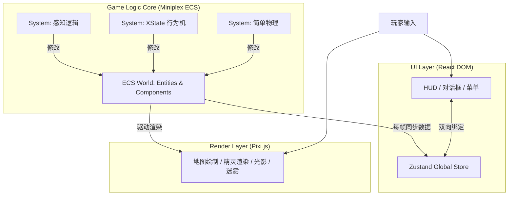

# 《深渊低语：封印纪元》游戏设计文档 (GDD)

**版本:** 1.0
**项目代号:** Project Abyss
**核心体验:** 反派模拟 / 策略 / 蝴蝶效应 RPG
**技术栈:** Web Native (React + Pixi.js + Miniplex ECS + XState)

---

## 1. 游戏概述 (Game Overview)

### 1.1 核心概念
玩家扮演一位被封印万年的魔王。作为一团无形的意识，你无法直接移动物体或杀人。你必须利用极其微弱的魔力（制造声响、熄灭烛火、托梦），诱导小镇“圣橡镇”（Oakhaven）的居民产生恐惧、愤怒或贪婪，从而收集更多魔力，招募信徒，最终破坏封印复活。

### 1.2 核心循环
1.  **观察 (Observe):** 利用上帝视角，观察 NPC 的日程和性格弱点。
2.  **干扰 (Influence):** 消耗微量魔力改变环境（蝴蝶效应的起点）。
3.  **收割 (Harvest):** 收集 NPC 因情绪波动掉落的“魔力”或“负面情绪”。
4.  **进化 (Evolve):** 升级能力（托梦、附身），转化核心信徒，对抗“守望者”。

---

## 2. 核心系统与玩法机制

### 2.1 资源系统
玩家需要平衡三种核心资源：

*   **魔力 (Mana/Essence):**
    *   **来源:** 随时间极其缓慢地自然恢复；信徒献祭；引发NPC的负面情绪（恐惧、愤怒、贪婪）。
    *   **用途:** 施放干扰、托梦、强化信徒。

*   **侵蚀度 (Corruption):**
    *   **定义:** 你对某个具体NPC或地点的掌控程度。
    *   **作用:** 侵蚀度越高，你能对该目标施加的影响就越强（从“让他打个喷嚏”到“完全精神控制”）。

*   **警惕值 (Suspicion):**
    *   **定义:** “守望者”（英雄后裔）对异常现象的察觉程度，是玩家的死亡倒计时。
    *   **机制:** 如果你在光天化日之下移动物体，或者NPC突然发疯，警惕值会暴涨。
    *   **后果:** 警惕值满格 = 守望者启动“大净化术”，游戏结束（被再次加固封印）。

### 2.2 独特的“反侦察”玩法
为了不被发现，玩家必须学会“嫁祸”。

*   **制造假象:** 故意留下伪造的证据，让守望者以为是邻国的间谍在搞破坏，或者是流窜的强盗团伙，而不是“魔王复苏”。
*   **牺牲棋子:** 当守望者快要查到你的核心信徒时，你可以主动引爆一个低级信徒（让他发狂攻击卫兵），让他背下所有黑锅，然后被处死，以此来清空警惕值。

---

## 3. 游戏进程与阶段

### 阶段一：幽灵与耳语 (The Ghost in the Walls)
封印极强，你只能像个闹鬼的幽灵。核心玩法是**蝴蝶效应**。

*   **操作示例:**
    *   弄熄蜡烛：让写信的贵族烦躁，导致商业伙伴决裂。
    *   弄湿地板：让仆人滑倒，引开守卫，让小偷信徒潜入。
    *   托梦（Inception）：在NPC睡眠时植入模糊的念头（如“力量”和“复仇”）。

### 阶段二：暗影结社 (The Cult of Shadows)
当你完全侵蚀并控制了第一个“代理人”后，游戏进入经营模式。

*   **建立势力:** 招募镇上边缘人（乞丐、不得志的学者等）。
*   **仪式系统:** 指挥信徒举行仪式，可大幅增加魔力，但有被“守望者”发现的风险。需要通过“调虎离山”等计策来规避。

### 阶段三：魔王降临 (The Awakening)
封印松动，你可以通过代理人施展神迹，甚至短时间实体化。

*   **高阶操作:**
    *   附身：短时间完全控制高侵蚀度的NPC。
    *   魔物召唤：从封印裂缝中召唤低级魔物。
*   **最终目标:** 破坏修道院地下的三个“镇压石柱”，完成复活。

---

## 4. NPC 系统 (NPC System)

NPC 不仅是棋子，他们拥有性格、日程表和记忆，是游戏涌现性的核心。

### 4.1 NPC 数据结构
```typescript
// 实体组件定义 (TypeScript Interface)
interface NpcEntity {
  id: string;
  name: string;
  role: 'CIVILIAN' | 'GUARD' | 'PRIEST' | 'TARGET';
  
  // 位置与渲染
  position: { x: number; y: number };
  sprite: string;

  // 核心数值
  stats: {
    willpower: number;  // 意志力 (抵抗直接干涉的阈值)
    sanity: number;     // 理智 (0 = 发疯/可转化)
    corruption: number; // 侵蚀度 (玩家掌控力)
  };

  // 感知组件
  perception: {
    sightRadius: number;
    hearingSensitivity: number; // 1.0 = 标准
  };

  // AI 行为
  aiState: 'IDLE' | 'WORK' | 'SUSPICIOUS' | 'FLEE' | 'SLEEP';
  traits: string[]; // 性格特质
  schedule: ScheduleItem[]; // 日程表
}
```

### 4.2 性格特质 (Traits)
特质决定了不同 NPC 对同一事件的不同反应：

| 特质 Tag | 描述 | 逻辑影响 |
| :--- | :--- | :--- |
| **SKEPTIC** | 怀疑论者 | 看到异象优先调查，不易掉 Sanity，容易增加警惕值。 |
| **COWARD** | 胆小鬼 | 极易受惊，产出大量魔力，会四处逃窜传播恐慌。 |
| **GLUTTON** | 暴食者 | 容易被食物诱饵吸引，甚至偏离既定日程。 |
| **DEVOUT** | 虔诚者 | 受惊后会跑向教堂（安全区），而不是回家。 |
| **DRUNKARD** | 酒鬼 | 感知范围减少，是散布谣言的最佳工具（因为大家觉得他在说胡话）。 |

### 4.3 日程表 (Schedule)
NPC 遵循分时段插槽系统，拥有固定的日程表，为玩家提供了“蹲点”的策略空间。高优先级的突发事件（如着火）可以打断当前日程。

```typescript
interface ScheduleItem {
  timeStart: number; // 0-2400 in-game time
  actionType: string;
  targetLocationId: string;
  priority: number;
}
```

### 4.4 运行时 AI 状态机
NPC 的行为由状态机驱动，推荐使用 **XState** 进行管理：
*   **Idle / Routine (日常态):** 执行日程任务。
*   **Suspicious (怀疑态):** 听到响声或看到异象，会前往调查。
*   **Alert / Fear (惊恐态):** 看到超自然现象，产出魔力，Sanity 下降，逃向安全区。
*   **Corrupted / Puppet (受控态):** 侵蚀度足够高时，玩家可发布间接指令。

---

## 5. 关卡与事件设计

### 5.1 新手关卡：L0_TheAwakening (苏醒)
*   **场景:** 修道院抄写室 (Scriptorium)
*   **目标:** 将学徒 Arthur 转化为第一名信徒。
*   **角色:**
    *   **Arthur (目标):** 特质 COWARD。
    *   **Father Thomas (威胁):** 特质 SKEPTIC。
    *   **Old Bill (干扰项):** 特质 DRUNKARD。
*   **核心流程:**
    1.  **教学 A (基础):** 指引玩家熄灭蜡烛，吓唬 Arthur，收集魔力。
    2.  **教学 B (规避):** Thomas 进屋。指引玩家推倒 Bill 旁边的花瓶，声东击西。
    3.  **教学 C (转化):** 趁 Thomas 背身，再次恐吓 Arthur 使其 Sanity 归零去睡觉。对他使用“托梦”，植入“力量与复仇”的念头，完成转化。

### 5.2 剧情事件示例：年度丰收祭典
*   **背景:** 全镇人聚集，守备松懈，但神圣力量最强。
*   **玩家选择:**
    *   **A. 蛰伏:** 什么都不做，积攒魔力。
    *   **B. 破坏 (高风险):** 制造火灾，趁乱让信徒破坏封印。
    *   **C. 腐化 (高收益):** 在酒水中掺入魔力，让全镇人做噩梦，收割大量负面情绪。

---

## 6. 技术规格 (Technical Specification)

### 6.1 技术选型
*   **开发语言:** TypeScript
*   **UI 框架:** React 18+ & Zustand (全局状态管理)
*   **渲染引擎:** Pixi.js (高性能 2D WebGL 渲染)
*   **逻辑核心:** Miniplex (轻量级实体组件系统 ECS)
*   **AI 状态机:** XState (可视化管理 NPC 行为逻辑)
*   **构建工具:** Vite
*   **CI/CD:** GitHub Actions (自动部署到 GitHub Pages)

### 6.2 架构分层图


### 6.3 开发者提示
*   **事件总线 (Event Bus):** 交互应高度解耦。例如，蜡烛熄灭应广播一个全局事件，而不是直接调用 NPC 的代码。
*   **调试工具 (Debug Tools):** 必须开发强大的上帝工具，用于一键修改游戏状态，这对测试蝴蝶效应至关重要。

---

## 7. 开发路线图 (Development Roadmap)

采用敏捷开发模式，每个阶段产出一个可玩的 MVP。

### 阶段一：核心交互原型 (The "Poltergeist" Prototype)
*   **目标:** 验证“玩家微操 -> NPC 反应”的基础闭环。
*   **内容:**
    *   搭建单个房间场景（酒馆一角）。
    *   实现“微操”系统：熄灭蜡烛、打翻杯子等。
    *   实现单一 NPC 的基础 AI（闲逛、惊吓、查看）。
*   **验收标准:** 一个可玩的 Demo，玩家可以像闹鬼一样捉弄一个 NPC，并得到合乎逻辑的反应。

### 阶段二：小镇生态与资源循环 (The "Town" MVP)
*   **目标:** 引入时间系统、资源循环和多 NPC 交互。
*   **内容:**
    *   游戏时钟与 NPC 日程表。
    *   魔力循环：消耗魔力 -> 制造骚动 -> 收集情绪球 -> 回充魔力。
    *   初级“托梦”系统。
*   **验收标准:** 一个微型沙盒，玩家需要通过吓唬路人积攒魔力，并通过托梦改变 NPC 第二天的行为。

### 阶段三：对抗体系与蝴蝶效应 (The Strategy Layer)
*   **目标:** 引入失败条件（守望者）和长期目标（信徒）。
*   **内容:**
    *   警惕值系统与“守望者”AI。
    *   信徒转化与指令系统。
    *   地下封印场景与技能树。
*   **验收标准:** 一个完整的游戏循环，包含敌人、资源、帮手和成长系统，可以进行一局完整的胜负判定。

### 阶段四：内容填充与打磨 (Content & Polish)
*   **目标:** 扩大游戏规模，增加变数和叙事深度。
*   **内容:**
    *   完成全镇地图和 30+ NPC。
    *   突发事件系统（如“瘟疫爆发”、“骑士团视察”）。
    *   实现多种胜利方式和最终的复活演出。
*   **验收标准:** Beta 版本，内容完整，可进行长时间的 Playtest 以调整数值平衡。
